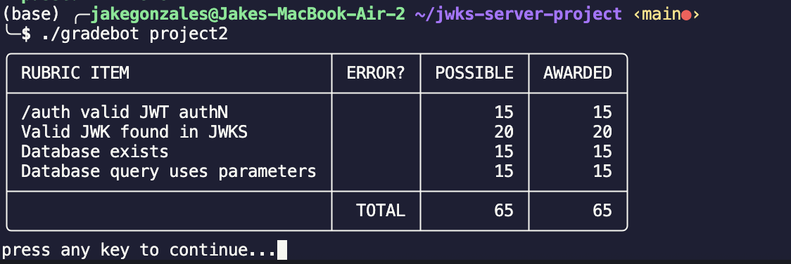
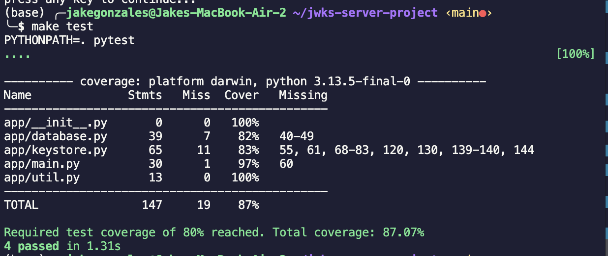

# JWKS Server Project

A minimal FastAPI server for serving JWKS and issuing JWTs for demo/testing purposes. Now with SQLite integration

## Prerequisites

- Python 3.11+
- pip
- SQLite3

## Installation

```sh
make install
```

## Running the Server

```sh
make run
```

The server will start at `http://localhost:8080`.

## Endpoints

- `GET /.well-known/jwks.json` — Returns the JWKS.
- `POST /auth` — Issues a JWT signed by the latest active key from the new database.
  - Accepts empty POST, JSON payload `{"username": "userABC", "password": "password123"}`, or HTTP Basic Auth
  - Returns a JWT with the user identifier in the `sub` claim
- `POST /auth?expired=1` — Issues a JWT signed by the latest expired key (with expired claims).

## Running Tests

```sh
make test
```

## Linting & Formatting

```sh
make lint
make format
```

## Project 2 - Extending the JWKS Server

### Features
- **SQLite Database**: Keys are persisted to `totally_not_my_privateKeys.db`
- **SQL Injection Protection**: All database queries use parameterized statements
- **Key Expiry**: Automatically generates expired and active keys for testing
- **Mock Authentication**: Accepts various authentication methods without actual validation

### Schema

```sql
CREATE TABLE IF NOT EXISTS keys(
    kid INTEGER PRIMARY KEY AUTOINCREMENT,
    key BLOB NOT NULL,
    exp INTEGER NOT NULL
)
```

## Screenshots


### Project 2

#### Gradebot Test Results (Project 2)


#### Test Coverage

