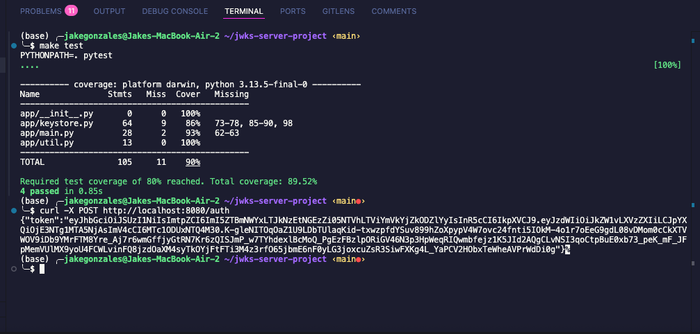

# JWKS Server Project

A minimal FastAPI server for serving JWKS and issuing JWTs for demo/testing purposes.

## Prerequisites

- Python 3.11+
- pip

## Installation

```sh
make install
```

## Running the Server

```sh
make run
```

The server will start at `http://localhost:8080`.

## Endpoints

- `GET /.well-known/jwks.json` — Returns the JWKS.
- `POST /auth` — Issues a JWT signed by the latest active key.
- `POST /auth?expired=1` — Issues a JWT signed by the latest expired key (with expired claims).

## Running Tests

```sh
make test
```

## Linting & Formatting

```sh
make lint
make format
```

## Screenshot


